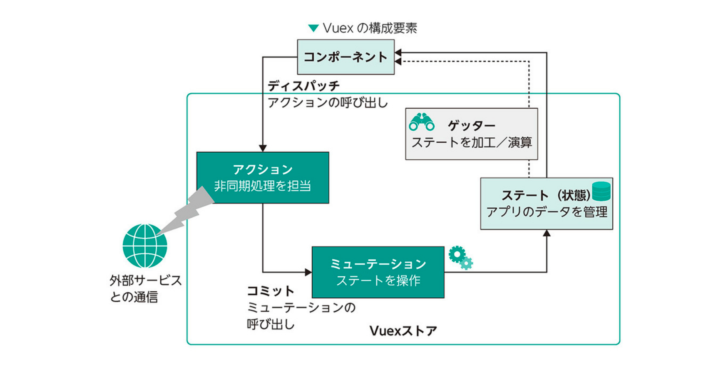

## vuex
### state , getters , mutations , actions

| 項目名       | 概要	                                              | コメント                                                                                                                        |
|-----------|--------------------------------------------------|-----------------------------------------------------------------------------------------------------------------------------|
| state     | Store で管理するデータ項目の定義	                             |                                                                                                                             |
| getters   | state 内のデータの状態から算出される値（≒算出プロパティ）	                |                                                                                                                             |
| mutations | state のデータを直接操作するための関数（非同期処理は定義不可）               | 它会接收两个默认的形参([state] [,payload])。state是当前Vuex对象中的state，payload是该方法在被调用时传递的额外参数，                                              |
| actions   | mutations の操作を各コンポーネントから呼び出すために使用する関数（非同期処理を定義可） | action函数接收一个与store实例具有相同方法和属性的context对象，所以可以调用context.commit提交一个mutation，或者通过context.state和context.getters来获取state和getters。 |

[//]: # (項目名	概要	)

[//]: # (state	Store で管理するデータ項目の定義	)

[//]: # (getters	state 内のデータの状態から算出される値（≒算出プロパティ）	)

[//]: # (mutations	state のデータを直接操作するための関数（非同期処理は定義不可）	它会接收两个默认的形参&#40;[state] [,payload]&#41;。state是当前Vuex对象中的state，payload是该方法在被调用时传递的额外参数，)

[//]: # (actions	mutations の操作を各コンポーネントから呼び出すために使用する関数（非同期処理を定義可）	action函数接收一个与store实例具有相同方法和属性的context对象，所以可以调用context.commit提交一个mutation，或者通过context.state和context.getters来获取state和getters。)

[//]: # (  * 类型：`string`)

[//]: # (  * 可选参数：)

[//]: # (    * `auto` 自动背景，一般会显示网格纹背景，如果在`config.js`设置了`bodyBgImg`时则无背景)

[//]: # (    * `none` 无背景)

[//]: # (    * `<大图地址>`，如`/img/bg.jpeg`)

[//]: # (    * `background: <自定义背景样式>`，如`background: blue`)

[//]: # (  * 默认： `auto`)




[//]: # (![]&#40;02.store_images/c3f59b09.png&#41;)
[//]: # (::: warning)

[//]: # (原默认主题首页的footer字段已改到`config.js`文件里设置)

[//]: # (:::)


### sample
- store
```ts
import { createStore } from 'vuex'
import { UPDATE_CURRENT, UPDATE_BOOK } from './mutation-types'
import createPersistedState from 'vuex-persistedstate'

export default createStore({
  state: {
    books: [],
    current: null
  },
  getters: {
    bookCount(state) {
      return state.books.length
    },
    allBooks(state) {
      return state.books
    },
    getRangeByPage(state) {
      return page => {
        const SIZE = 3
        return state.books.slice((page - 1) * SIZE, (page - 1) * SIZE + SIZE)
      }
    },
    getBookById(state) {
      return id => {
        return state.books.find(book => book.id === id)
      }
    },
    current(state) {
      return state.current;
    }
  },
  mutations: {
    [UPDATE_CURRENT](state, payload) {
      state.current = payload
    },
    [UPDATE_BOOK](state, payload) {
      const b = this.getters.getBookById(payload.id)
      if (b) {
        Object.assign(b, payload)
      } else {
        state.books.push(payload)
      }
    }
  },
  actions: {
    [UPDATE_CURRENT]({ commit }, payload) {
      commit(UPDATE_CURRENT, payload)
    },
    [UPDATE_BOOK]({ commit }, payload) {
      commit(UPDATE_BOOK, payload)
    }
  },
  plugins: [
    createPersistedState({
      key: 'reading-recorder',
      storage: localStorage
    })
  ]
})
```

```ts
export const UPDATE_CURRENT = 'updateCurrent'
export const UPDATE_BOOK = 'updateBook'
```


- action発行

```ts
<script>
import { ref, computed, onMounted, h } from 'vue'
import { useStore } from 'vuex';
import { useRouter } from 'vue-router'
import { ElNotification } from 'element-plus'
import BookInfo from '@/views/BookInfo.vue'
import { UPDATE_CURRENT, UPDATE_BOOK } from '@/store/mutation-types'

export default {
  name: 'BookForm',
  components: {
    BookInfo
  },
  setup() {
    const store = useStore()
    const router = useRouter()

    const myform = ref(null)
    const book = ref({})
    const form = ref({
      read: new Date(),
       memo: ''
    })
    const rules = ref({
      memo: [
        { required: true, message: 'メモが未入力です。', trigger: 'blur' }
      ]
    })
    const current = computed(() => store.getters.current)
    const getBookById = (id) => store.getters.getBookById(id)

    if (!current.value) {
      router.push('/')
    }
    Object.assign(book.value, current.value)

    onMounted(() => {
      const b = getBookById(book.value.id)
      if (b) {
        form.value.read = b.read
        form.value.memo = b.memo
      }
    })

    const onsubmit = () => {
      myform.value.validate(valid => {
        if (valid) {
          store.dispatch(
            UPDATE_BOOK, 
            Object.assign({}, book.value, form.value)
          )
          store.dispatch(UPDATE_CURRENT, null)
          ElNotification.success({
            title: 'Reading Recorder',
            message: h('p', { style: 'color: #009' },
              '読書情報の登録／更新に成功しました。'),
            duration: 2000
          })
          form.value.read = new Date()
          form.value.memo = ''
          router.push('/')
        }
      })
    }    

    return {
      book,
      form,
      rules,
      onsubmit,
      myform
    }
  },
}
</script>
```


## pina


### sample


- store
```ts
// store
export const useAuthStore = defineStore({
    id: 'auth',
    state: () => ({
        // initialize state from local storage to enable user to stay logged in
        user: JSON.parse(localStorage.getItem('user')),
        returnUrl: null
    }),
    actions: {
        async login(username, password) {
            const user = await fetchWrapper.post(`${baseUrl}/authenticate`, { username, password });

            // update pinia state
            this.user = user;

            // store user details and jwt in local storage to keep user logged in between page refreshes
            localStorage.setItem('user', JSON.stringify(user));

            // redirect to previous url or default to home page
            router.push(this.returnUrl || '/');
        },
        logout() {
            this.user = null;
            localStorage.removeItem('user');
            router.push('/login');
        }
    }
});
```

- action　発行
```
<script setup>
import { Form, Field } from 'vee-validate';
import * as Yup from 'yup';

import { useAuthStore } from '@/stores';

const schema = Yup.object().shape({
    username: Yup.string().required('Username is required'),
    password: Yup.string().required('Password is required')
});

function onSubmit(values, { setErrors }) {
    const authStore = useAuthStore();
    const { username, password } = values;

    return authStore.login(username, password)
        .catch(error => setErrors({ apiError: error }));
}
</script>
```
## Reference
* [これから始めるVue.js3 入門](https://www.amazon.co.jp/%E3%81%93%E3%82%8C%E3%81%8B%E3%82%89%E3%81%AF%E3%81%98%E3%82%81%E3%82%8BVue-js-3%E5%AE%9F%E8%B7%B5%E5%85%A5%E9%96%80-%E5%B1%B1%E7%94%B0-%E7%A5%A5%E5%AF%9B/dp/4815613362)
* [How to consume APIs with Vuex, Pinia, and Axios](https://blog.logrocket.com/consume-apis-vuex-pinia-axios/#understanding-state-management)
* [2022年の最新標準！ Vue 3の新しい開発体験に触れよう](https://ics.media/entry/220120/)
*[](test) 