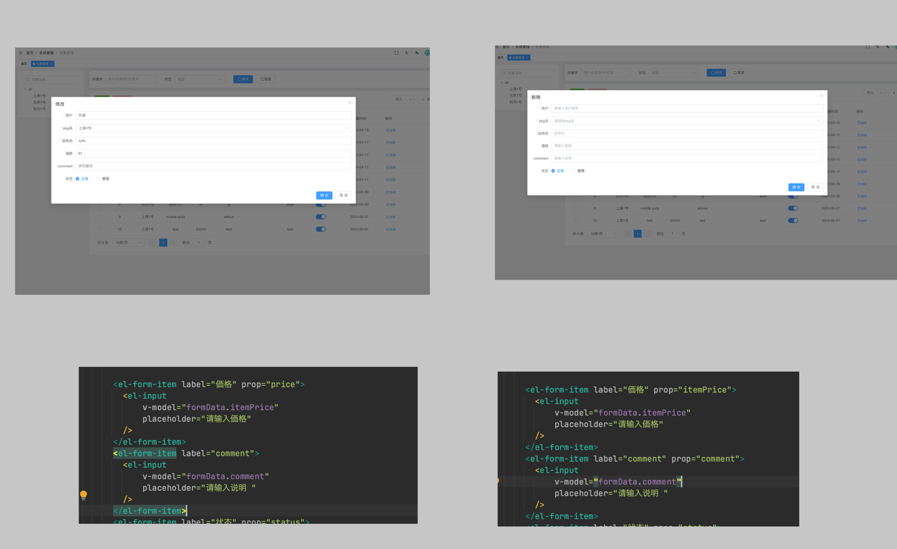
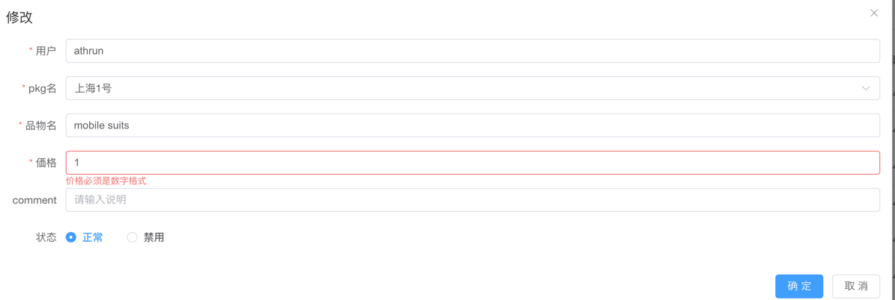
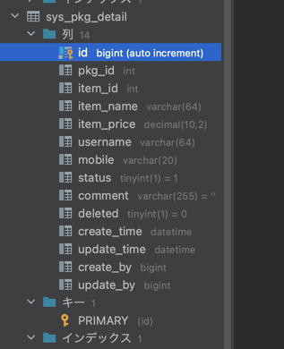

## form表单有一部分项目没清除


-  原因
el-form-item 必须有 prop属性，和v-model绑定的参数名要一致




## element表单验证是number类型时，验证失败
v-model默认String类型，rules不识别



```vue
        <el-form-item label="価格" prop="itemPrice">
          <el-input
              v-model="formData.itemPrice"
              placeholder="请输入価格"
          />
        </el-form-item>
```

### 登陆失败


```
{
    "code": "B0001",
    "data": null,
    "msg": "\n### Error updating database.  Cause: java.sql.SQLIntegrityConstraintViolationException: Duplicate entry 'test' for key 'login_name'\n### The error may exist in com/youlai/system/mapper/SysPkgDetailMapper.java (best guess)\n### The error may involve com.youlai.system.mapper.SysPkgDetailMapper.insert-Inline\n### The error occurred while setting parameters\n### SQL: INSERT INTO sys_pkg_detail  ( pkg_id,  item_name, item_price, username,  status,     create_time, update_time )  VALUES (  ?,  ?, ?, ?,  ?,     ?, ?  )\n### Cause: java.sql.SQLIntegrityConstraintViolationException: Duplicate entry 'test' for key 'login_name'\n; Duplicate entry 'test' for key 'login_name'"
}
```
-  原因
建表时 把id和user_name 当成key了，删除username


## 参考：
- [vue3+element-plus 弹框表单重置(resetFields)失效、无效解决](https://blog.csdn.net/qq_42071369/article/details/127297117)

- [element表单验证是number类型时，验证失败](https://blog.csdn.net/m0_47265814/article/details/120707609)