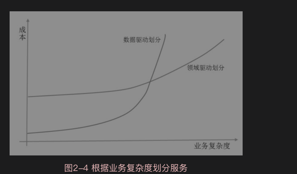

## 微服务的拆分

·通过业务功能分解并定义与业务功能相对应的服务。
·将域驱动设计分解为多个子域。
·按照动词或用例分解，并定义负责特定操作的服务，例如一个负责完成订单的航运服务。
·通过定义一个对给定类型的实体或资源的所有操作负责的服务来分解名词或资源，例如一个负责管理用户账户的账户服务。

## 微服务的拆分

## 垂直划分优先原则

## 持续演进原则

## 服务自治、接口隔离原则
##  自动化驱动原则

