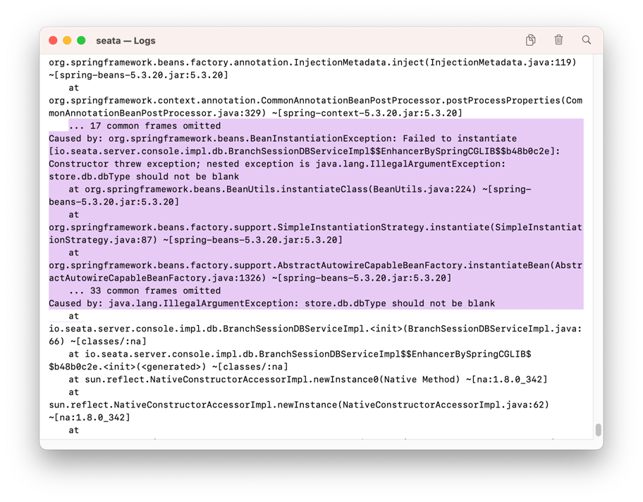

## 配置参考 

- [Linux 环境下使用 Docker 部署 Seata 1.7.1 (图文教程)](https://youlai.blog.csdn.net/article/details/133376131)


按照youlai的例子，配置失败

### 现像1



```
... 17 common frames omitted
Caused by: org.springframework.beans.BeanInstantiationException: Failed to instantiate [io.seata.server.console.impl.db.BranchSessionDBServiceImpl$$EnhancerBySpringCGLIB$$b48b0c2e]: Constructor threw exception; nested exception is java.lang.IllegalArgumentException: store.db.dbType should not be blank
	at org.springframework.beans.BeanUtils.instantiateClass(BeanUtils.java:224) ~[spring-beans-5.3.20.jar:5.3.20]
	at org.springframework.beans.factory.support.SimpleInstantiationStrategy.instantiate(SimpleInstantiationStrategy.java:87) ~[spring-beans-5.3.20.jar:5.3.20]
	at org.springframework.beans.factory.support.AbstractAutowireCapableBeanFactory.instantiateBean(AbstractAutowireCapableBeanFactory.java:1326) ~[spring-beans-5.3.20.jar:5.3.20]
	... 33 common frames omitted
Caused by: java.lang.IllegalArgumentException: store.db.dbType should not be blank
```
### 原因対策   
docker 配置用了docker内网,识别不到127.0.0.1

server-addr: 改成docker内网IP
```
127.0.0.1 -> 192.168.228.2:8848 
```

```
  config:
    type: nacos  # support: nacos, consul, apollo, zk, etcd3
    nacos:
      server-addr: 192.168.228.2:8848     # 容器内部ip 创建nacos容器时已指定
      namespace: public
      group: DEFAULT_GROUP
      username:
      password:
      context-path:
      data-id: seataServer.properties
  # 注册中心-nacos
  registry:
    type: nacos  # support: nacos, eureka, redis, zk, consul, etcd3, sofa
    nacos:
      application: seata-server
      server-addr: 192.168.228.2:8848     # 容器内部ip 创建nacos容器时已指定
      group: DEFAULT_GROUP
      namespace: public
#      cluster: default    # TC 集群名称，下文 Seata 客户端中配置事务分组名和集群名映射使用
      username:
      password:
```

### 现像2

```
 ERROR --- [ionPool-Create-1928254791] [aba.druid.pool.DruidDataSource] [                 run]  [] : create connection SQLException, url: jdbc:mysql://localhost:3306/seata?useUnicode=true&rewriteBatchedStatements=true, errorCode 0, state 08S01
==>
com.mysql.cj.jdbc.exceptions.CommunicationsException: Communications link failure

The last packet sent successfully to the server was 0 milliseconds ago. The driver has not received any packets from the server.
	at com.mysql.cj.jdbc.exceptions.SQLError.createCommunicationsException(SQLError.java:174) ~[mysql-connector-java-8.0.28.jar:8.0.28]


```

### 原因対策  

SEATA_IP指定seata-server启动的IP, 该IP用于向注册中心注册时使用；设置一个能容器外部能ping通的地址，在同一台服务器部署设置为本机ip地址

```
store.db.datasource=druid
store.db.dbType=mysql
store.db.driverClassName=com.mysql.jdbc.Driver
#store.db.url=jdbc:mysql://localhost:3306/seata?useUnicode=true&rewriteBatchedStatements=true
store.db.url=jdbc:mysql://nacos-mysql:3306/seata?useUnicode=true&rewriteBatchedStatements=true
```


## Reference
- [Linux 环境下使用 Docker 部署 Seata 1.7.1 (图文教程)](https://youlai.blog.csdn.net/article/details/133376131)
- [springcloud nacos 2.3.0+seata 2.0.0](https://juejin.cn/post/7310415386406617127)

