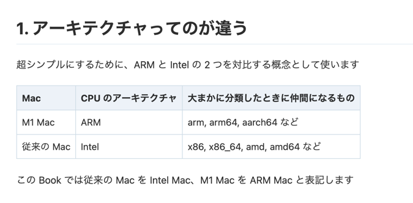
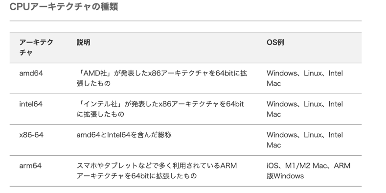

## OrbStack

### download
[download](https://orbstack.dev/)

```sh
brew install orbstack

```

### 起動

```sh
docker run -it -p 80:80 docker/getting-started
```


```sh
volumes:
  - /path/on/host:/path/in/container:ro
```

这将把主机上的/path/on/host目录映射到容器中的/path/in/container目录，并将其设置为只读模式（ro）。

需要注意的是，当我们将一个目录设置为只读模式时，容器无法在该目录中创建新的文件或目录，因为这需要写入权限。如果容器需要在该目录中创建文件，我们应该将它们设置为读写模式（rw）。


Two suffixes :z or :Z can be added to the volume mount. These suffixes tell Docker to relabel file objects on the shared volumes. 

- The z option tells Docker that the volume content will be shared between containers. Docker will label the content with a shared content label. Shared volumes labels allow all containers to read/write content.
- The Z option tells Docker to label the content with a private unshared label.


## アーキテクチャ　mac m1





## Reference

- [OrbStack使ってみた](https://zenn.dev/daifukuninja/articles/6285b5491a05e5)
- [Apple Silicon（M1/M2）環境で、a-blog cms の docker環境を用意する](https://developer.a-blogcms.jp/blog/custom/docker-arm64.html)